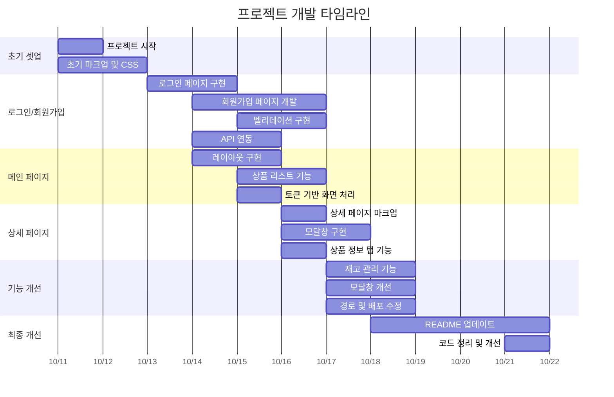

# 🛒 OPEN MARKET SERVICE


> 배포주소: https://siwoon1602.github.io/OpenMarket_Service/

> 테스트 계정  
> 구매자 (buyer): ID: buyer1 / PW: weniv1234  
> 판매자 (seller): ID: seller1 / PW: weniv1234

## 🔧 사용 기술스택

 

## 1. 프로젝트의 목표와 기능

### 1.1 프로젝트 목표

- 판매자와 구매자를 구별하여 판매자가 상품을 등록, 판매하며 구매자는 구매하는 서비스입니다.
- 서버 API를 제공받으며 API를 사용하여 기능을 구현합니다.
- 바닐라 자바스크립트를 이용한 API 통신과 DOM 활용 그 외 자바스크립트 능률을 향상시킵니다.

### 1.2 구현페이지

#### ✨ 필수 구현! ✨

구매자 페이지:

- 로그인 페이지
- 회원 가입 페이지
- 상품 목록 페이지
- 상품 상세 페이지

#### ✨ 선택 구현! ✨

판매자 페이지:

- 로그인 페이지
- 회원 가입 페이지
- 상품 목록 페이지
- 상품 상세 페이지

### 1.3 팀 구성

## 🙋‍♂️ Developer

|                FrontEnd                 |
| :-------------------------------------: |
|              |
| [윤시운](https://github.com/siwoon1602) |

## 2. 요구사항과 기능 명세

### 2.1 구매자 페이지

#### 로그인 페이지

| 📌  |            기능             | 내용                                              | 상태 |
| :-: | :-------------------------: | :------------------------------------------------ | :--: |
|  1  | 아이디, 비밀번호 유효성검사 | 유효성검사 실패시 경고문구                        |  ✅  |
|  2  |     유효성검사 실패 시      | 로그인 불가                                       |  ✅  |
|  3  | 입력창에 값이 비어있는 경우 | 비어있는 입력창에 focus이벤트 발생 및 로그인 불가 |  ✅  |
|  4  |  아이디 비밀번호 불일치 시  | 비밀번호 입력창에 focus이벤트 발생 및 빈칸 처리   |  ✅  |
|  5  |         로그인 성공         | 로그인 버튼을 누른 페이지로 이동                  |  ✅  |

#### 회원가입 페이지

| 📌  |                기능                | 내용                                     | 상태 |
| :-: | :--------------------------------: | :--------------------------------------- | :--: |
|  1  | 유효한 입력창 + 회원가입 동의 체크 | 회원가입 버튼 활성화                     |  ✅  |
|  2  |        입력창 값 미입력 시         | 미입력 입력창에 필수정보 입니다 경고문구 |  ✅  |
|  3  |           회원가입 성공            | 로그인 페이지로 이동                     |  ✅  |
|  4  |    아이디 중복확인 버튼 클릭 시    | 중복인 경우 입력창 하단 경고 문구        |  ✅  |
|  5  |   구매회원 가입 탭 클릭, 가입 시   | 구매자로 회원가입                        |  ✅  |
|  6  |   판매회원 가입 탭 클릭, 가입 시   | 판매자로 회원가입                        |  ✅  |

[나머지 테이블들도 동일한 포맷으로 계속...]

## 3. 프로젝트 구조

```
📦 Openmartket_Service
 ┣ 📂 asset
 ┣ 📂 images
 ┣ 📂 js
 ┃ ┣ 📜 detail.js
 ┃ ┣ 📜 join.js
 ┃ ┣ 📜 login.js
 ┃ ┣ 📜 cart.js
 ┃ ┗ 📜 main.js
 ┣ 📂 style
 ┃ ┣ 📜 common.css
 ┃ ┣ 📜 detail.css
 ┃ ┣ 📜 cart.css
 ┃ ┣ 📜 error.css
 ┃ ┣ 📜 join.css
 ┃ ┣ 📜 joinSucced.css
 ┃ ┣ 📜 login.css
 ┃ ┣ 📜 main.css
 ┃ ┗ 📜 reset.css
 ┣ 📜 details.html
 ┣ 📜 error.html
 ┣ 📜 index.html
 ┣ 📜 join.html
 ┣ 📜 joinSucced.html
 ┣ 📜 login.html
 ┗ 📜 README.md
```

## 4. 개발 일정



## 5. 와이어프레임 / UI

### 페이지 구성

#### 로그인 페이지


#### 회원가입 페이지


#### 상품 목록 페이지


#### 상품 상세 페이지


#### 공통 모달


#### 에러페이지


## 6. 에러와 해결방법

- **라우터 구현 이슈**: 라우터를 제대로 이해하지 못해 적용에 실패했으나, API 응답값의 ID를 URL에 활용하여 동적 라우팅을 구현했습니다.

- **로그인 TAP 구현**: z-index만으로는 테두리선과 텍스트 위치가 맞지 않아, 이미지를 활용한 border 처리 방식으로 해결했습니다.

- **페이지 새로고침 이슈**: 로그인 후 이전 페이지에서 DOM이 업데이트되지 않는 문제를 pageshow 이벤트를 사용하여 해결했습니다.

## 7. 개발하며 느낀점

- API를 통한 서버와의 데이터 통신 경험을 쌓을 수 있었습니다.
- 새로운 함수, DOM 이벤트, 데이터 접근법 등을 학습하며 성장했습니다.
- 로컬 개발환경과 배포환경의 차이점을 이해하고, QA/QC의 중요성을 깨달았습니다.
- 프로젝트 기획, 시간 분배, 요구사항 파악의 중요성을 체감했습니다.

## 8. 추후 개발 계획

- React 학습 후 코드 리팩토링 예정
- 판매자 페이지 추가 구현 예정
