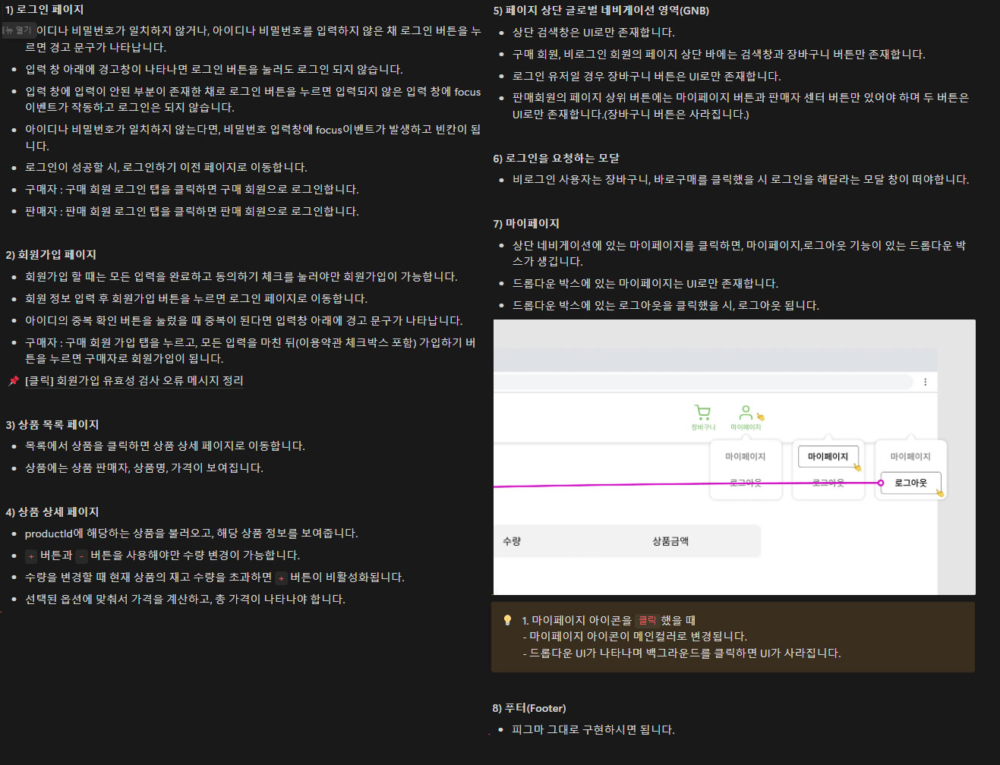
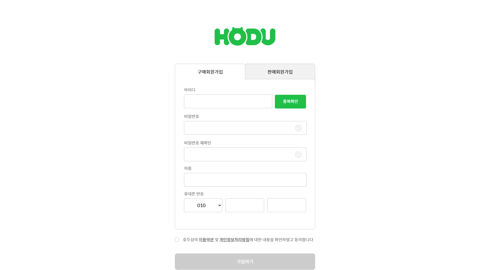
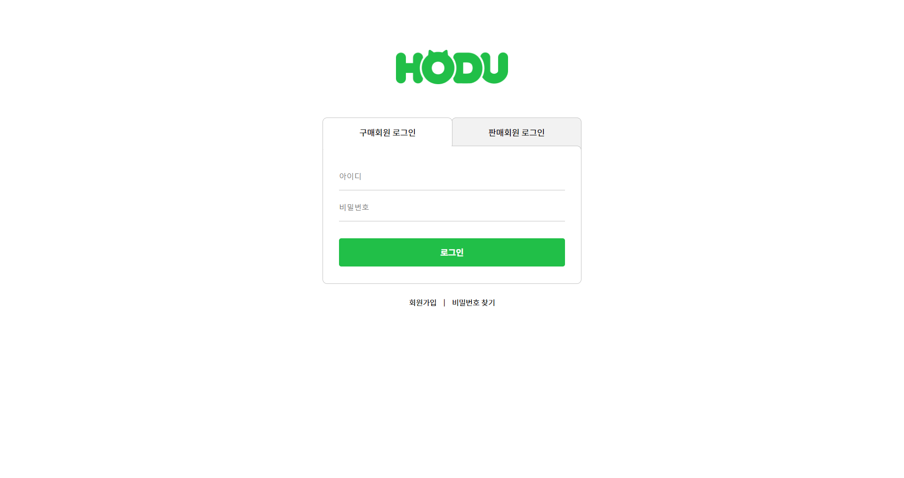
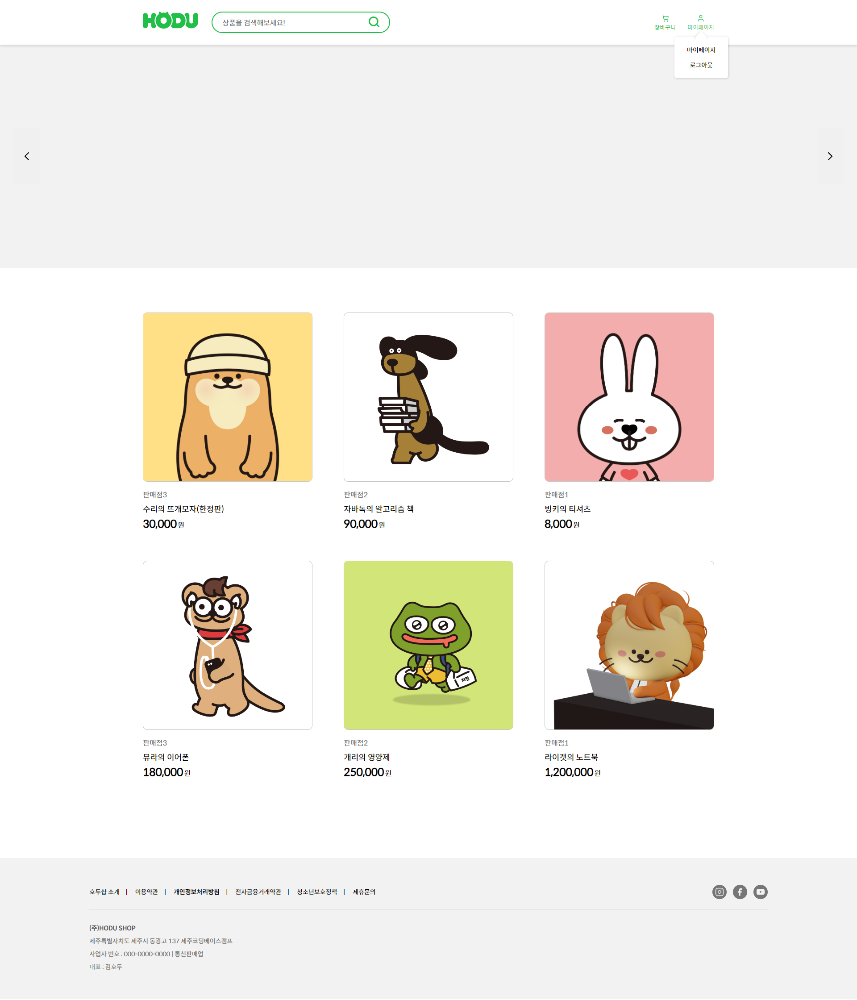

# 오픈마켓 서비스

> 배포주소 : https://siwoon1602.github.io/OpenMarket_Service/  
> 🛠 사용 기술스택 :     

## 1. 프로젝트의 목표와 기능

### 1.1 프로젝트 목표

- 판매자와 구매자를 구별하여 판매자가 상품을 등록, 판매하며 구매자는 구매하는 서비스입니다.
- 서버 API를 제공받으며 API를 사용하여 기능을 구현 합니다.
- 바닐라 자바스크립트를 이용한 API 통신과 DOM 활용 그 외 자바스크립트 능률을 향상시킵니다.

### 1.2 구현페이지

     ✨필수 구현!✨

- 로그인 페이지
- 회원 가입 페이지
- 상품 목록 페이지
- 상품 상세 페이지

### 1.3 팀 구성

- 윤시운 ( 이번 project는 개인 프로젝트 입니다.)

## 2. 요구사항과 기능 명세

## 3. 프로젝트 구조

📦Openmartket_Service  
 ┣ 📂asset  
 ┣ 📂images  
 ┣ 📂js  
 ┃ ┣ 📜detail.js  
 ┃ ┣ 📜join.js  
 ┃ ┣ 📜login.js  
 ┃ ┗ 📜main.js  
 ┣ 📂style  
 ┃ ┣ 📜common.css  
 ┃ ┣ 📜detail.css  
 ┃ ┣ 📜error.css  
 ┃ ┣ 📜join.css  
 ┃ ┣ 📜login.css  
 ┃ ┣ 📜main.css  
 ┃ ┗ 📜reset.css  
 ┣ 📜details.html  
 ┣ 📜error.html  
 ┣ 📜index.html  
 ┣ 📜join.html  
 ┣ 📜login.html  
 ┗ 📜README.md

### 4. 와이어프레임 / UI

#### 필수 구현페이지

<table>
    <tbody>
        <tr>
            <td>회원가입</td>
            <td>로그인</td>
        </tr>
        <tr>
            <td>
		
            </td>
            <td>
                
            </td>
        </tr>
        <tr>
            <td>상품 목록</td>
            <td>상품 상세</td>
        </tr>
        <tr>
            <td>
                
            </td>
            <td>
                
            </td>
        </tr>
        <tr>
            <td>상품목록 모달 ON</td>
            <td>상품상세 모달 ON</td>
        </tr>
        <tr>
            <td>
                
            </td>
            <td>
                
            </td>
        </tr>
        
    </tbody>
</table>

## 5. 에러와 해결방법

- a
- b
- c

## 6. 개발하며 느낀점

- a
- b
- c

## 7. 추후 개발 계획

- a
- b
- c
