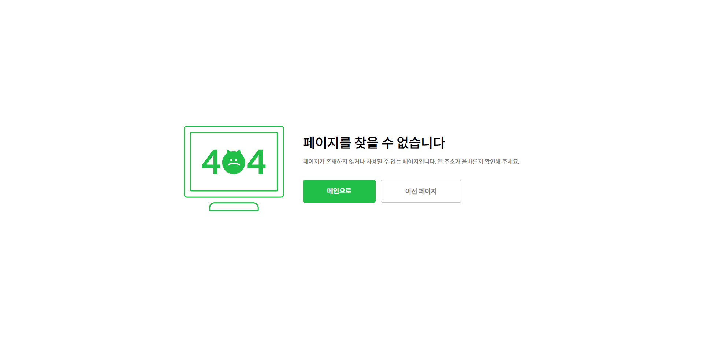

<!-- logo -->

# 🛒OPEN MARTKET_SERVICE   

 

> 배포주소 : https://siwoon1602.github.io/OpenMarket_Service/  

🔧🪛사용 기술스택 : 
   

## 1. 프로젝트의 목표와 기능

### 1.1 프로젝트 목표

- 판매자와 구매자를 구별하여 판매자가 상품을 등록, 판매하며 구매자는 구매하는 서비스입니다.
- 서버 API를 제공받으며 API를 사용하여 기능을 구현합니다.
- 바닐라 자바스크립트를 이용한 API 통신과 DOM 활용 그 외 자바스크립트 능률을 향상시킵니다.

### 1.2 구현페이지

✨필수 구현!✨

구매자 페이지

- 로그인 페이지
- 회원 가입 페이지
- 상품 목록 페이지
- 상품 상세 페이지

✨선택 구현!✨

판매자 페이지

- 로그인 페이지
- 회원 가입 페이지
- 상품 목록 페이지
- 상품 상세 페이지

### 1.3 팀 구성

## 🙋‍♂️ Developer

|              FrontEnd              |
| :--------------------------------: |
|        |
| [윤시운](https://github.com/JGeun) |

## 2. 요구사항과 기능 명세 

### 2.1 구매자 페이지

| 📌  |        로그인 페이지        | 내용                                              |     |
| :-: | :-------------------------: | :------------------------------------------------ | :-: |
|  1  | 아이디, 비밀번호 유효성검사 | 유효성검사 실패시 경고문구                        | ✅  |
|  2  |     유효성검사 실패 시      | 로그인 불가                                       | ✅  |
|  3  | 입력창에 값이 비어있는 경우 | 비어있는 입력창에 focus이벤트 발생 및 로그인 불가 | ✅  |
|  4  |  아이디 비밀번호 불일치 시  | 비밀번호 입력창에 focus이벤트 발생 및 빈칸 처리   | ✅  |
|  5  |         로그인 성공         | 로그인 버튼을 누른 페이지로 이동                  | ✅  |

 

| 📌  |          회원가입 페이지           | 내용                                     |     |
| :-: | :--------------------------------: | :--------------------------------------- | :-: |
|  1  | 유효한 입력창 + 회원가입 동의 체크 | 회원가입 버튼 활성화                     | ✅  |
|  2  |        입력창 값 미입력 시         | 미입력 입력창에 필수정보 입니다 경고문구 | ✅  |
|  3  |           회원가입 성공            | 로그인 페이지로 이동                     | ✅  |
|  4  |    아이디 중복확인 버튼 클릭 시    | 중복인 경우 입력창 하단 경고 문구        | ✅  |
|  5  |   구매회원 가입 탭 클릭, 가입 시   | 구매자로 회원가입                        | ✅  |
|  6  |   판매회원 가입 탭 클릭, 가입 시   | 판매자로 회원가입                        | ✅  |

 

| 📌  |    상품목록 페이지    | 내용                             |     |
| :-: | :-------------------: | :------------------------------- | :-: |
|  1  | 리스트의 상품 클릭 시 | 일치하는 상품 상세 페이지로 이동 | ✅  |
|  2  |       상품 정보       | 판매자,상품명,가격 노출          | ✅  |

 

| 📌  | 상품상세 페이지 | 내용                                                          |     |
| :-: | :-------------: | :------------------------------------------------------------ | :-: |
|  1  |  Page Open 시   | productId에 해당하는 상품을 불러오고, 해당 상품 정보를 보여줌 | ✅  |
|  2  | 상품 수량 변경  | + 와 - 버튼 외 수량 변경 불가                                 | ✅  |
|  3  |  재고수량 체크  | 현재 상품의 재고 수량 초과시 +버튼 비활성화                   |     |
|  4  |  재고 품절 시   | 현재 상품의 재고 수량이 0일시 구매,장바구니 버튼 비활성화     | ✅  |
|  5  |  총 가격 계산   | 선택된 옵션에 맞춰서 가격을 계산하고, 총 가격 노출            | ✅  |

## 3. 프로젝트 구조

📦Openmartket_Service  
 ┣ 📂asset  
 ┣ 📂images  
 ┣ 📂js  
 ┃ ┣ 📜detail.js  
 ┃ ┣ 📜join.js  
 ┃ ┣ 📜login.js  
 ┃ ┗ 📜main.js  
 ┣ 📂style  
 ┃ ┣ 📜common.css  
 ┃ ┣ 📜detail.css  
 ┃ ┣ 📜error.css  
 ┃ ┣ 📜join.css  
 ┃ ┣ 📜login.css  
 ┃ ┣ 📜main.css  
 ┃ ┗ 📜reset.css  
 ┣ 📜details.html  
 ┣ 📜error.html  
 ┣ 📜index.html  
 ┣ 📜join.html  
 ┣ 📜login.html  
 ┗ 📜README.md

## 4. 개발 일정

### 5. 와이어프레임 / UI

#### 페이지 구성

- 로그인 페이지

    
    

  

- 회원가입 페이지

    
    

  

- 상품 목록 페이지

  

- 상품 상세 페이지

  

- 상품 상세 페이지 & 상품 목록페이지 공통 모달

  

- 에러페이지

  

## 6. 에러와 해결방법

- 라우터를 제대로 이해못하고 만들어 적용하려다 실패하였고 다른 방법을 찾았습니다 api응답값을 이용하여 동적으로 생성해낸 상품들마다의 id값을 url에 부여하고 응답데이터의 id값과 url의 id값이 일치하면 해당 id의 응답값을 동적으로 화면에 뿌려주게끔 설계했습니다

- 로그인 TAP 구현시 z-index를 활용해서 만들어보려고 했으나 z-index 속성만으로는 테두리선이 안맞거나 텍스트 위치가 틀어지는 현상이 발생하였고, 다른 사이트에서 비슷한 화면을 찾아보고 이미지를 통해 border를 가리는 방식으로 화면을 구현했습니다.

- 로그인 페이지에서 토큰을 로컬 스토리지에 저장한 후 이전 페이지로 돌아가면 해당 페이지의 HTML 요소가 업데이트되지 않는 현상이 발생하여 pageshow 이벤트를 사용하여 페이지가 보여질 때마다 토큰을 확인하고 DOM을 업데이트 할 수있도록 해결하였습니다.

## 7. 개발하며 느낀점

- 지금것 로컬에서 화면,기능 구현만 해왔는데 , API를 통해 서버와 데이터를 주고 받으며 데이터를 활용 해보는 좋은 개발 경험이였습니다.

- 사용해보지 못했거나 존재조차 몰랐던 함수 , DOM 이벤트 , 데이터 접근법 등을 사용해보고 알게되었고 아직도 많은 정보들이 많고 공부의 필요성을 느꼈습니다.

- 로컬에서 개발할때와 배포했을때의 환경은 다르고
  QA/QC는 필수적으로 진행해야한다는걸 알았습니다.

- 프로젝트 진행시에는 꼭 프로젝트 기획과 시간 분배 , 진행 전 프로젝트 요구사항과 명세 등 미리 파악하고 진행해야 한다는점을 뼈저리게 느꼈습니다.

## 8. 추후 개발 계획

- 추후 React 지식 습득 후 코드 리팩토링 예정
- 필수 구현페이지 외 선택 구현 (판매자페이지) 페이지 추가 예정
